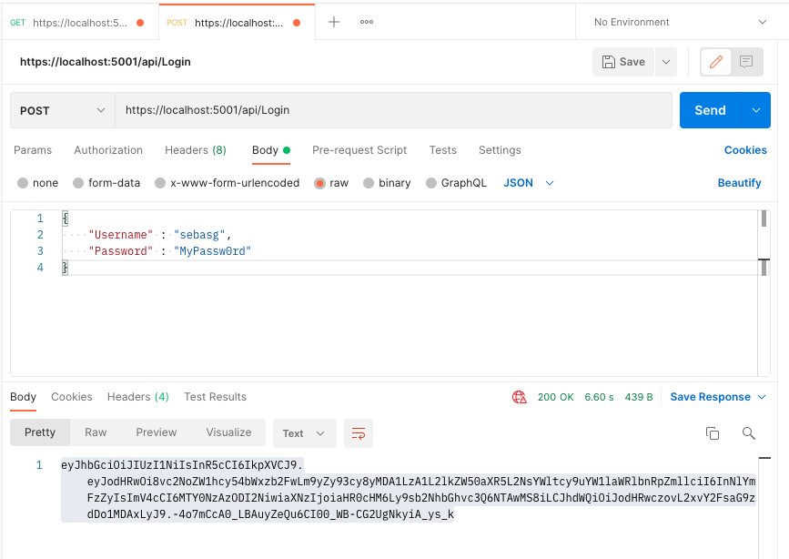
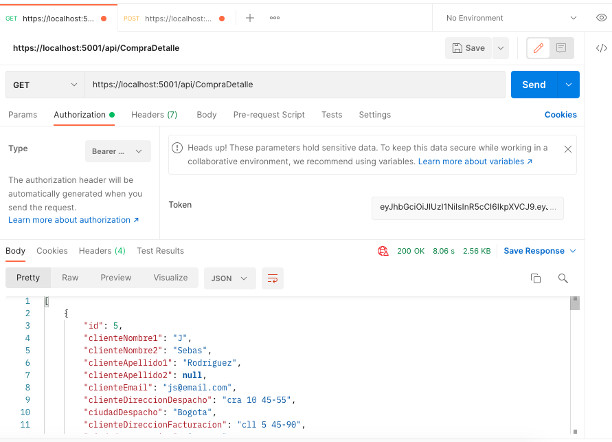
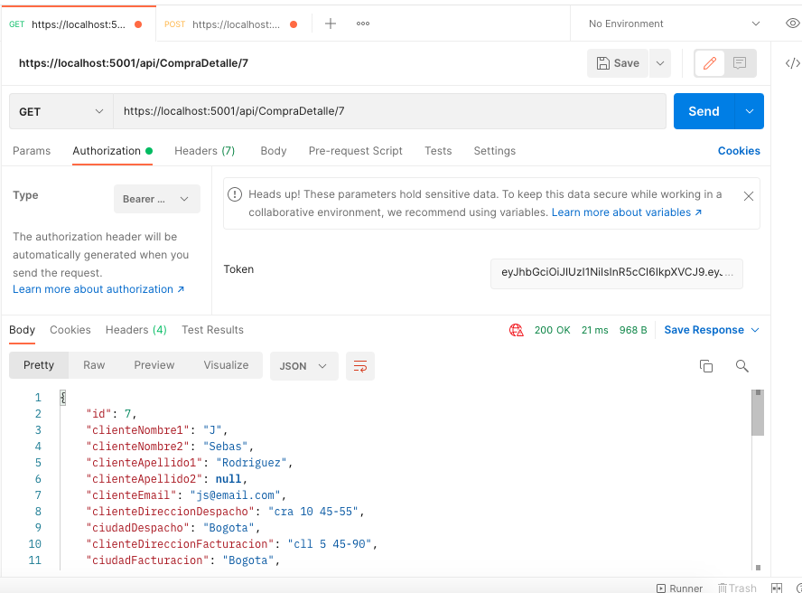
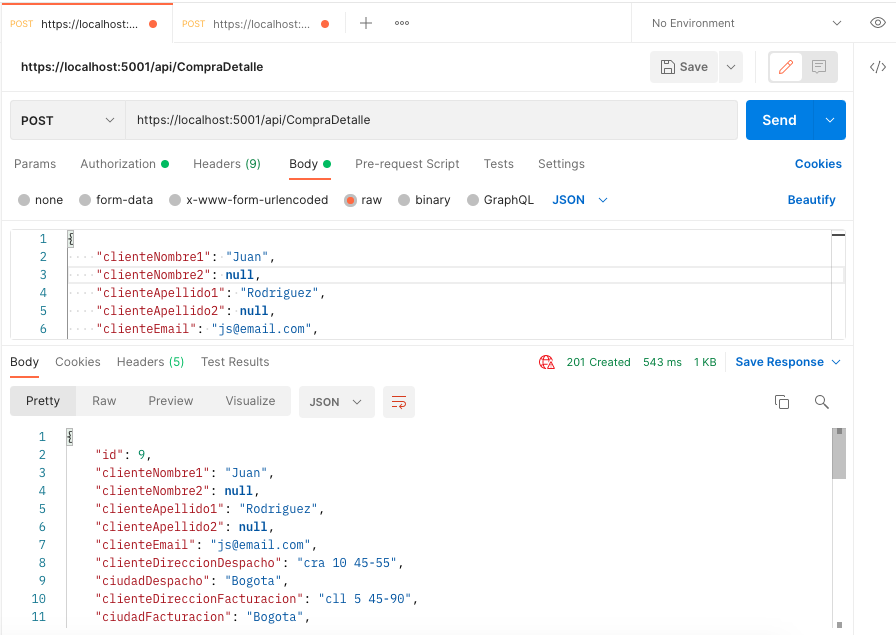
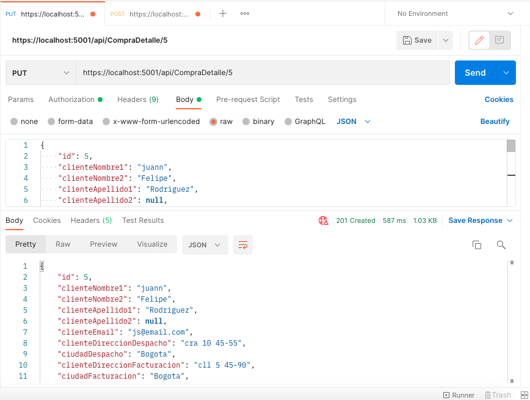
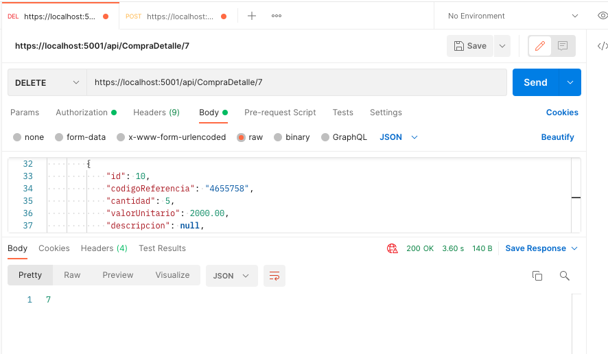

# ApiRestCompra

This is a Api Rest that allows you to do the crud on the Purchase-Detail entities.

This Api Rest was created at the request of a job admission process.

## Table of contents

- [Overview](#overview)
  - [The challenge](#the-challenge)
  - [Screenshot](#screenshot)
- [My process](#my-process)
  - [Built with](#built-with)
- [Author](#author)

## Overview

### The challenge

- Create Api Rest that would allow querying, creating, editing and deleting Purchase-Details entities.
- User must have an authentication service by means of username and password returning a token with a validity of 60 minutes.
- Creation of log table to validate traceability.

### Screenshot

- Token

- Get

- Get(id)

- Post

- Put(id)

- Delete(id)

## My process

### Built with

- ASP .NET Core.
- Entity Framework Core (ORM). 
- First Code workflow.
- Serilog (logs).
- Jwt (Token).

## Author

- Linkedin - (https://www.linkedin.com/in/sebasg/)

